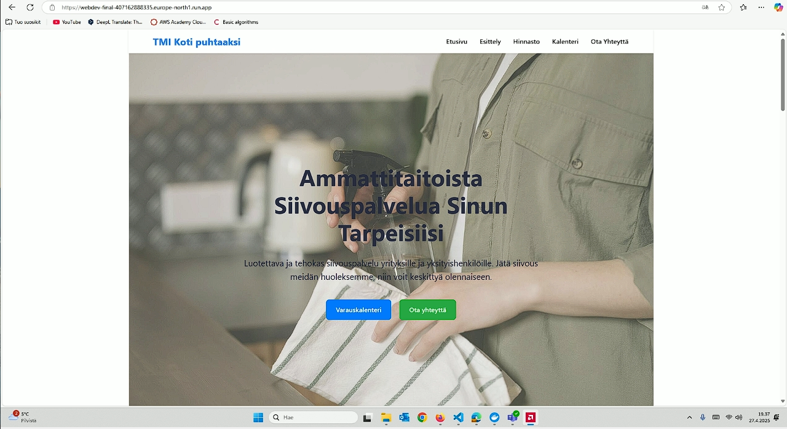
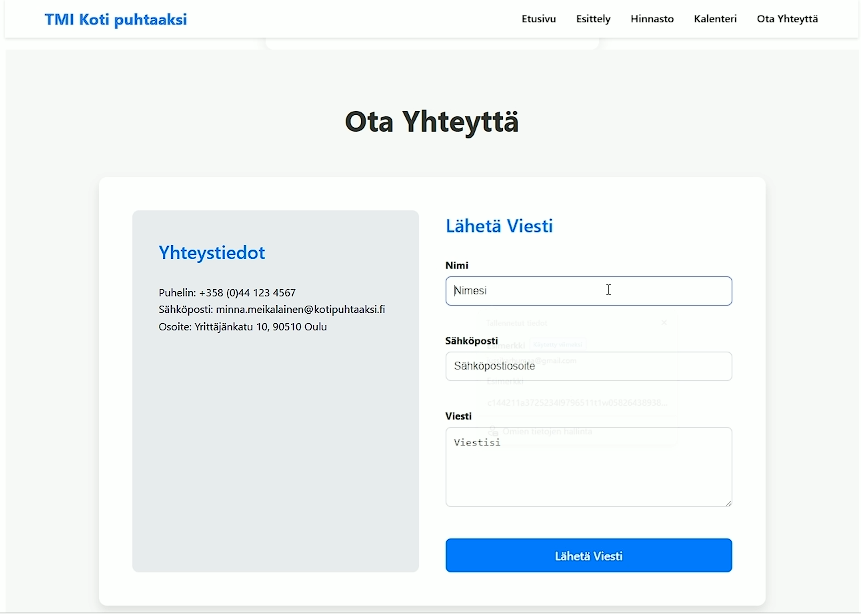
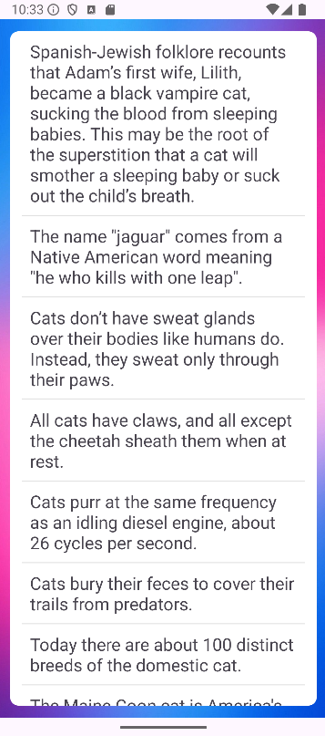
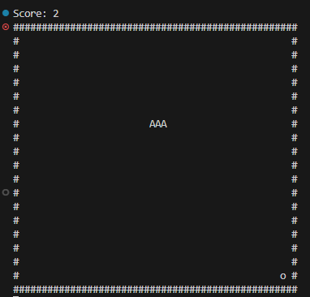
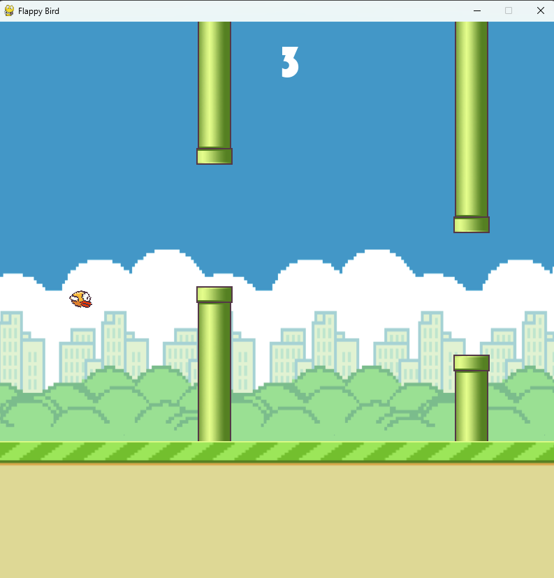

  🎓 ICT Student | 💻 Software Development | 🤖 AI</strong> 
<strong>Centria University of Applied Sciences</strong>

---

## 🚀 About me

I am a **curious and enthusiastic ICT student** who enjoys learning new things and working on practical projects.  
I am especially interested in **full-stack development, cloud services, and AI applications**.

My goal is to work in software development and learn from professionals as part of a team.

---

## 🛠️ Technologies & Tools

**Programming languages**
- Python  
  - LangChain  
- C#

**Web & backend**
- JavaScript, HTML, CSS  
- React, Vite  
- Express.js  

**Databases & cloud**
- MongoDB  
- AWS  
- Google Cloud  

**Other**
- Docker  
- Git & GitHub  
- REST APIs  
- Arduino / IoT  

---

## 🏅 Badges & Certifications

- **AWS Academy Graduate – Cloud Developing – Training Badge** (AWS)  
- **AWS Academy Graduate – Cloud Foundations – Training Badge** (AWS)  
- **Introduction to Cybersecurity** – Issued by Cisco  

---

## 📂 Projects

🔹 **React + Express + MongoDB Web App**  
https://github.com/Jussipekkak/WebDev-Final/
 
**Demo video: https://youtu.be/2Hh4z-gHG6I**

- Full-stack project  
- Frontend built with React, backend with Express  
- MongoDB as the database  

  

🔹 **Kotlin API Fragment Android App**  
https://github.com/Jussipekkak/Kotlin-API-Fragment

- Android app built with Kotlin using Fragments for UI management  
- Fetches data from an external REST API and processes JSON responses  
- Goal was to learn Android app structure and API integration basics  

  

🔹 **C# Snake Game (Console)**  
https://github.com/Jussipekkak/C-Snake  

Goals:
- Practice C# fundamentals  
- Understand the game loop  
- Implement simple collision logic  
- Use lists and objects to manage game state  

  

🔹 **Arduino IoT Project**  
https://github.com/Jussipekkak/Arduino-project  

- IoT project where I was responsible for writing the code in C++  
- Measures soil moisture and light levels  
- Sends data to a server  

  

🔹 **Python – Flappy Bird Clone**  
https://github.com/Jussipekkak/FlappyBird  

- A **Flappy Bird clone** built with **Python and the Pygame library**  

---

## What I want to learn more about

- Full-stack development  
- AI application development  
- Cloud-based architectures  
- Teamwork in real projects  

---

## 📫 Contact

- 💼 LinkedIn: www.linkedin.com/in/jussi-pekka-karhumaa-b14265255  
- 📧 Email: Jussikarhumaa@gmail.com  
- 🌐 GitHub: https://github.com/Jussipekkak  

---

⭐ Thanks for checking out my profile!

